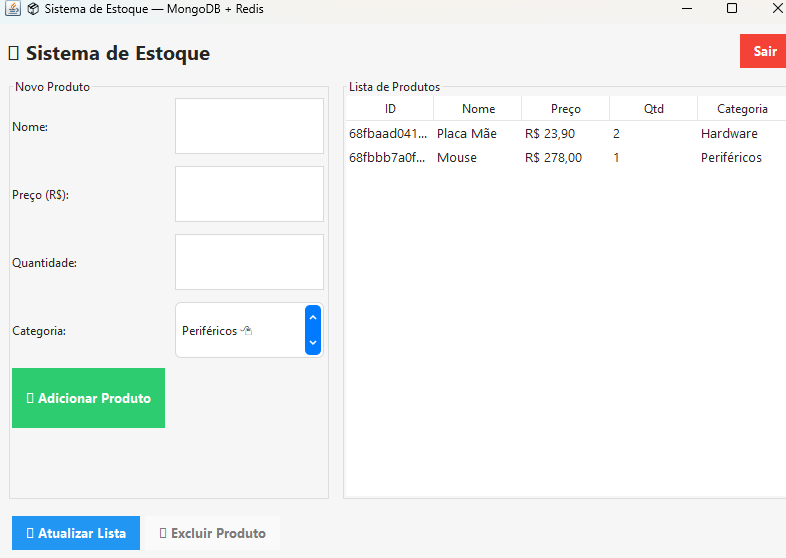

# 🧩 Sistema de Estoque — Java + MongoDB + Redis

Este projeto é um **sistema de gerenciamento de estoque** desenvolvido em **Java**, utilizando uma **interface gráfica (GUI)** construída com **Swing**, e integração com **MongoDB (banco de dados NoSQL)** e **Redis (cache em memória)** para otimizar o desempenho das consultas.

---

## 🚀 Tecnologias Utilizadas

| Tecnologia | Função |
|-------------|--------|
| **Java 22 (Swing)** | Interface gráfica e lógica principal |
| **MongoDB Atlas** | Banco de dados principal para armazenamento persistente |
| **Redis** | Cache em memória para acelerar consultas e armazenar sessões |
| **Docker** | Execução do container Redis localmente |
| **Jedis** | Cliente Java para comunicação com o Redis |
| **MongoDB Java Driver** | Driver oficial para integração com o MongoDB |
| **Gson** | Conversão entre objetos Java e JSON |

---

## 🖥️ Interface Gráfica (Java Swing)

O sistema possui uma **interface amigável** com os seguintes recursos:

- 🧾 **Cadastro de produtos** (nome, preço, quantidade e categoria);
- 📋 **Listagem dinâmica** dos produtos armazenados;
- ✏️ **Atualização** de produtos existentes;
- ❌ **Exclusão** de produtos por ID;
- 📦 **Categorias pré-definidas** com menu de seleção;
- ⚡ **Integração com cache Redis** para respostas instantâneas.



> 💡 A interface é construída em Java Swing com componentes personalizáveis e feedback visual (botões coloridos e mensagens de status).

---

## ⚡ Integração com o Redis

O Redis é utilizado para **armazenar em cache as consultas de produtos** e evitar acesso repetido ao MongoDB.

### Funcionamento do cache:
1. Quando o usuário lista os produtos:
   - O sistema busca no Redis a chave `produtos:all`.
   - Se existir → os dados vêm do cache (rápido).
   - Se não existir → o sistema busca no MongoDB e **salva no Redis**.

2. Quando o usuário **adiciona, atualiza ou exclui** um produto:
   - O cache é **invalidado automaticamente**, forçando atualização dos dados.

### Exemplo de chaves no Redis:
```bash
127.0.0.1:6379> keys *
1) "produtos:all"
2) "sessao:jose"
